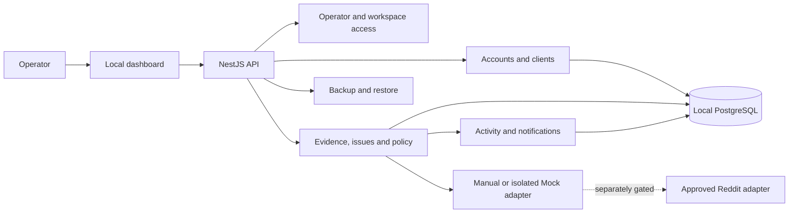

# Architecture — implemented MVP and historical proposal

## Proxy-first UX extension — RO-PROXY-UX-001

October 2, 2026: retain the existing same-origin Node/SQLite architecture. `web/operations.js` is a served browser module for guided route/account setup, readiness and isolated Mock state. No new runtime dependency or database schema migration.

Local proxy records include provider, requested US city/country and optional expected IP; observations stay Unknown/null. Owner-only `POST /api/proxies/:id/configure` pauses linked local records and invalidates connection observations/reservations, while retaining restriction evidence. `POST /api/proxies/:id/check` and `POST /api/accounts/:id/open` enforce account access and return capability unavailable without external traffic. Actual first verified connection is read-only and null in this release; manual reports and incoming account payloads cannot set it.

Mock state is frontend memory only, with explicit source labels and no write API calls. Simulated network blocking is a UX state, not an enforcement mechanism. A future companion must prove per-profile routing, no direct fallback, account identity and exclusive sessions before these capabilities become available. Proxy credential integration and all live access remain separate work.

## Implemented MVP — RO-MVP-001

Current implementation uses a single same-origin Node HTTP server (`app/server.mjs`), SQLite schema/storage (`app/store.mjs`), domain projection (`app/domain.mjs`), Node cryptography (`app/security.mjs`) and framework-free browser UI (`web/`). This deliberately replaces the unimplemented Next/Nest/PostgreSQL baseline for local MVP delivery. No npm runtime dependencies or Docker infrastructure. Reviewed deployment remains future scope. The proposal below is a historical baseline.

One workspace has a first-run owner and up to five active members. Sessions, account assignments, redacted audit and manual reservations are enforced on the server. Records have account/client/proxy identifiers and transactions; secrets are AES-GCM ciphertext with an external local key. SQLite uses WAL and a version marker. Registry writes and audit commit together. SSE sends payload-free invalidation events; clients fetch their own authorized state. External observation/companion adapters are Unavailable.

Encrypted recovery includes the master key inside the passphrase-encrypted payload, validates references and owner email, then rekeys secrets to the destination key and replaces data transactionally. Sessions/reservations are excluded and invalidated; evidence is reset and accounts paused. Local Host/Origin/CSRF protections and HTTP cookie behavior are tested. HTTPS/remote host/proxy/key protection is not configured. See [runbook](MVP_RUNBOOK.md) and [checkpoint](agent/tasks/RO-MVP-001.md) for current evidence and limitations.

Date: October 1, 2026. Source: [scope](PROJECT_SPEC.md) and [brief](source/REDDIT_OPS_CODEX_PROJECT_BRIEF.md). Reconcile against the checkout in RO-000 before using these paths or choosing versions.

## Baseline and dependency choices

| Area | Proposed choice | Reason / boundary |
| --- | --- | --- |
| UI | Next.js, React, TypeScript, Tailwind, shadcn/ui | Brief baseline; reuse any suitable existing implementation |
| API | Node.js/NestJS modular monolith | One backend owns permissions, persistence and audit |
| Storage | Local PostgreSQL plus versioned migrations | Durable records and transactional writes; no cloud prerequisite |
| Local packaging | Docker Compose after approval | UI/API/database only initially; loopback host bindings |
| Durable workers | PostgreSQL job records; Redis/BullMQ only when worker scheduling is introduced | Base CRUD/manual checks require no worker fleet |

No package versions, ORM or test runner have been verified. Select supported compatible versions and a single migration/contract pattern only after repository inspection. Compose and runtime setup require later implementation authorization; none are created or executed by this task.

## Ownership and modules

Module boundaries: Access authenticates the operator; Registry manages accounts/clients/assignments; Connections manages configuration and secret references; Evidence records immutable observations; Operations derives statuses and manages issues/tasks/pause; Activity and Notifications record redacted outcomes; Recovery owns backups. Integration adapters never decide permission. Future AI/TOBI adapters use scoped APIs/events and cannot write directly to the database.

Proposed locations: `apps/web/`, `apps/api/src/modules/{access,accounts,clients,connections,evidence,operations,activity,notifications,recovery,integrations}/`, `packages/contracts/`, `database/migrations/`, `tests/e2e/`. These directories do not currently exist in the supplied workspace.

## Initial data model

Use generated IDs, UTC timestamps, workspace ID on owned records and validated references. UI displays the operator's selected timezone. One workspace does not justify removing scope checks.

| Entity | Initial fields and relationships |
| --- | --- |
| Workspace / User / OperatorSession | Workspace label; operator password hash; revocable session hash/expiry; local first-run claim |
| RedditAccount | Workspace, normalized username, ownership type/attestation/review date, purpose, tags, notes, archived_at, integration mode, pause reason/version |
| Client / AccountAssignment | Workspace, brand context, objectives, approved community references/notes; account-client link, purpose, active dates; ownership stays on account |
| Connection / ConnectionAssignment | Workspace, direct/proxy configuration, secret_ref, intended API route; account reference; effective dates and configuration version |
| Authorization / IntegrationPermission | Account, declared or verified status, granted scopes/capabilities, expiry, evidence reference, token secret_ref; platform use-case permission kept separate from operator attestation |
| SecretRecord | Encrypted ciphertext, nonce/tag, key version; never returned by general record APIs |
| HealthCheck / Observation | Account, optional connection/auth reference, source/mode, checked_at, expires_at, outcome/reason, evidence reference and configuration version |
| Issue / OperatorTask | Account/client context, category, state, next step, reason, relevant observation; optional due date; resolution evidence |
| PolicyDecision | Account/workspace, capability, allow/deny reason, evaluated_at, policy/config versions; retained when evaluating work or changing pause |
| ActivityEvent / Notification | Actor/context/action/result/reason/correlation ID, source and time; deduplicated alert linkage, read/resolved state |
| BackupRun | Format/schema version, completion/error state, size/checksum, non-secret destination description; no keys/passphrases |

Job records are introduced only with durable checks: account/capability, status, unique idempotency key, attempt count, lease, scheduled time, config version and cancellation reason. Later Community/RuleSnapshot/Campaign/Draft/Approval/Publication tables are not created now. Community references can be small local records or validated metadata until rule workflows exist.

Constraints: unique workspace + normalized username; assignments require account and client in the same workspace; secret reads require separate access; archived clients keep historical context but prevent new assignments; account archive never silently deletes history. Client assignments do not grant client access. Audit and command mutation commit in one transaction; notifications derive from that committed event.

## Contracts

Proposed authenticated operations include account/client CRUD, assignments, manual observations, available check requests, issue resolution, pause/resume, activity reads and backup preview/export/restore. Validate input on the server; hide secrets in response projections.

Shared response metadata: `requestId`, `mode`, `source`, `checkedAt`, `expiresAt`, `capabilities`. Error shape: `code`, plain-language `message`, `fieldErrors`, `retryable`, `nextAction`, `requestId`. Suggested codes include `UNAUTHORIZED`, `WORKSPACE_DENIED`, `VALIDATION_FAILED`, `DUPLICATE_ACCOUNT`, `CAPABILITY_UNAVAILABLE`, `STALE_EVIDENCE`, `CONFIG_CHANGED`, `CHECK_FAILED`, `RESTORE_INVALID`, `KEY_UNAVAILABLE`. No stack traces, credentials or arbitrary provider response bodies reach the UI.

Versioned local domain events: AccountAdded, AssignmentChanged, ObservationRecorded, IssueOpened, AccountPaused, AccountResumed, BackupCompleted. Payloads contain IDs/context/result, not content or secrets. Future integrations use an outbox when asynchronous delivery is required, not an event bus in the initial CRUD slice.

## State and execution

Connection states: unconfigured, configured/unverified, passed, failed, stale. Authorization states: manual-only, declared/unverified, pending, valid, expired, revoked, unavailable. Pause state is independent. Restrictions carry unknown/none-observed/reported/confirmed-supported evidence; none-observed is not a safety guarantee.

Manual-only execution never invokes a Reddit adapter. Mock fixtures use isolated storage or an explicit demo workspace and cannot update real records as verified observations. Live check dispatch verifies platform grant, operator consent, scope, route, pause and configuration version. Configuration changes invalidate dependent checks.

Resume requires current relevant checks and an explicit operator command; successful checks never auto-resume. For manual accounts, resume permits only local/manual operations after relevant checklist completion and leaves platform facts unknown. An unresolved required failure denies resume. When jobs later exist, serialize per account, revalidate at execution and use leases/idempotency keys; restart recovers pending state. Check retries may be bounded; future uncertain publishing results enter reconciliation rather than reposting.

## Security and local operation

Bind host service ports to loopback; keep the database private to the local application network. First-run operator creation is single-use and transactional. Password hashing uses a reviewed password library; sessions are server-side and revocable. Validate Origin/Host and CSRF on mutations, protect against DNS rebinding and apply authentication rate limits. Cookie behavior must be tested for the actual loopback HTTP/HTTPS deployment; do not blindly copy production-only settings that break local login. Remote/LAN use is a later security decision.

Use a reviewed authenticated-encryption library for secrets, with a versioned local master key protected outside source and ordinary exports. OS credential protection may protect the active key, but portable restore must recover it through a separately encrypted envelope, not depend solely on the original machine. Locking/revocation removes active sessions. Do not log raw request/provider payloads or place secrets in browser storage.

Optional proxy checks validate a fixed allowlisted destination, scheme/port, DNS resolution and every redirect; block loopback/private/link-local/metadata addresses and rebinding. Apply bounded timeout/size, redact credentials and never silently fall back to a direct route. These checks need a separate enabled scope; they do not validate a browser session.

## Backup and retention

RO-UX-005 accepted direction adds a future shared online workspace and per-member local companion. Frontend account/evidence/session interfaces are recorded in [Asset UX](ASSET_UX_SPEC.md); shared server authorization and browser leases remain proposed RO-W10/RO-B10, with no hosting or companion service installed. The offline HTML role switch and locks are explicitly simulations.

The proposed account details, avatar fallback, proxy evidence, safeguard restrictions and continuous event-store/local-stream contracts are elaborated in [Account operations modules](ACCOUNT_OPERATIONS_MODULES.md). They are not backend implementations. The prototype has no secure secret store, database, durable event replay or live Reddit observer.

Base backup contains local registry/client/config/task/audit metadata and encrypted secret records, plus format/schema/checksum manifest and a portable master-key envelope. Encrypt the entire archive with a recovery passphrase using reviewed key derivation and authenticated encryption. The UI never saves that passphrase or includes it in the archive. Teach the operator to keep it separately. No plaintext download or secret CSV export.

Proposed recovery target: last successful backup (no zero-data-loss promise). Show last backup and remind after 24 hours without one; no automatic schedule is assumed. Initial owner acceptance target is restore of the 15-account fixture within 15 minutes on the documented test machine; measure before promising it.

Restore sequence: authenticate and confirm target → validate archive size/path/version/checksums and passphrase → restore into disposable staging DB → verify relationships, decryption and counts → show preview → obtain explicit replacement confirmation and preserve rollback snapshot → maintenance lock → switch only after validation → revoke sessions, keep accounts paused and invalidate old live authorization/check evidence → smoke check and intentional resume. Failure preserves original storage; incompatible versions fail with a supported next step. Test wrong key, corrupted archive, disk full, interrupted restore, missing key and rollback.

No raw imported Reddit content is stored or backed up in the base release. Future approved content caching requires verified retention/deletion rules, deletion reconciliation, sanitization of identifying references and purge coverage across exports and existing backup copies. Default later design excludes provider content caches from backups. An offline restore must not resurrect deleted provider content or treat old evidence as fresh; live enablement waits for reconciliation. The approved retention approach must exist before content import begins.
