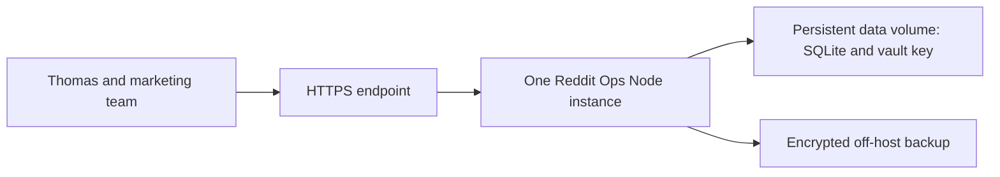

# Cloud deployment options — RO-CLOUD-001

Researched October 2, 2026. Recommendation only; no hosting account, deployment, infrastructure, application code, local operator data, commit or push changed. Base revision: `7567b335f5c828eaceb6c05bea83542126890f55`. Prices are USD and should be rechecked when selecting a service.

## Recommendation

Prefer Railway for a small online pilot because it can retain the current Node/SQLite design with a persistent volume and managed public HTTPS. Start with disposable test data under its Trial/Free limits. For regular owner/team access, prefer a paid plan with a defined spending ceiling; Hobby starts at $5/month with $5 included usage, and excess usage increases the bill. This is an architectural recommendation, not proof that this application's real usage fits any quota.

If zero recurring hosting cost is a strict requirement, Oracle Always Free is the strongest direct-fit option researched: a VM with persistent storage retains the existing same-host reverse-proxy architecture. Setup/maintenance effort is greater; regional capacity and idle reclamation make it a weaker default for business availability. Do not manufacture traffic to defeat idle policies.

Thomas subsequently required command-line setup and operations, and explicitly requested comparison of Vercel, Netlify and Hostinger. All three have official CLIs; CLI availability does not establish compatibility with the current persistent Node/SQLite application. Railway remains the easiest managed candidate. Among the three newly requested providers, prefer Hostinger VPS for preserving the current architecture and full server control; it requires paid hosting and server maintenance. Vercel/Netlify are candidates for a separate frontend or a deliberate backend/storage migration, rather than an unchanged full-MVP upload.

## CLI requirement and additional providers

| Provider | Verified command-line access | Free/commercial boundary | Fit for this MVP |
| --- | --- | --- | --- |
| Railway | Official `railway` CLI, Windows installation options, interactive login, deployment, variables, volume management, logs and service SSH. | Trial/Free credits and paid Hobby described below; costs depend on usage. | Recommended managed option after the bounded port/binding/persistence changes below. |
| Vercel | Official `vercel` CLI: login, deploy, environment configuration, logs and rollback. | Hobby is restricted to non-commercial personal use. Reddit Ops business/team use should select a permitted commercial plan. | Vercel explicitly documents that local-file SQLite is incompatible with its serverless persistent-storage model. Requires migrating storage/handlers/coordination, or hosting the backend elsewhere. Paying for Pro alone does not fix this architectural mismatch. |
| Netlify | Official `netlify` CLI: browser login, project linking, deploy and continuous-deployment setup. | Current Free offer has a 300-credit monthly limit shared across deploys/compute/requests/bandwidth and other billed usage. | Functions execute in ephemeral runtimes; the current long-lived Node server plus local SQLite/key directory is not an unchanged deployment. Netlify Database and Blobs exist, but using them requires a reviewed migration; alternatively host the backend separately. |
| Hostinger VPS | Official `hostinger` API CLI (Windows binary; browser sign-in or API token) manages VPS resources/DNS. SSH separately runs app deployment, Node processes, HTTPS reverse proxy, logs and recovery on the server. | Paid VPS. At research time the US page advertises KVM 1 at $6.49/month equivalent, renewal $11.99/month for two years; plans are prepaid. Region, term, tax and checkout affect the actual total. | Strongest architecture fit among these three: one Node process and durable SQLite/key directory behind a same-host reverse proxy. Capacity and operating security still need verification; advertised weekly snapshots are not proof of application-consistent encrypted recovery. |

Hostinger Business/Cloud managed Node hosting is distinct from VPS: official documentation supports Node 22 and GitHub deployment, but npm commands cannot be run through SSH there. Deployment-managed `hbuilds/` and `public_html` files are overwritten on redeploy. A supported durable writable location for this app's database/WAL/key has not been confirmed, so do not use these managed plans for real operator records until persistence and CLI deployment capabilities are verified. This is a specific unresolved requirement, not a claim that Hostinger has no managed Node hosting.

### Proposed CLI setup flow — not executed

1. Thomas chooses provider, allowed recurring/prepaid budget and fresh cloud test data versus an authorized encrypted import. Hosting-provider collaborator seats are distinct from Reddit Ops' application members.
2. Review/install only the selected official CLI, keeping local caches/configuration on D where supported. Thomas completes provider sign-in in the browser; use least-privilege access and local secret storage, never tokens/passwords in chat or Git. No automatic agent/skill configuration is needed.
3. Prepare the chosen provider's deployment files and local checks. For VPS, additionally establish SSH key access, a dedicated app user, firewall, service supervision and HTTPS. The API CLI manages the provider; SSH manages the running application.
4. After explicit service/deployment authorization, create/connect resources, deploy, and verify HTTPS login, member isolation, restart/redeploy persistence, logs, encrypted recovery and rollback using disposable records. Buying a plan or transferring real records requires its relevant authorization.
5. Record the verified URL, revision, operating commands, costs/limits and recovery procedure. Current status: documentation researched; no provider CLI installed/authenticated, resources created or public app verified in this task.

## Current application constraints, verified from source

- `package.json`: Node `>=22.14.0 <23`, no runtime npm dependencies. `app/store.mjs` uses built-in SQLite with WAL, persisted `ops.sqlite`, `vault.key` and initial setup token in the data directory.
- `app/server.mjs`: binds `127.0.0.1`; recognizes `REDDIT_OPS_PORT`, not the platform's generic `PORT`. Strict Host/Origin checks and optional HTTPS canonical `REDDIT_OPS_ORIGIN`; Secure session cookies when that HTTPS origin is configured.
- Operator sessions, assignments and audit are stored in SQLite. Losing the data directory is not merely losing a cache. A recreated vault key cannot decrypt old protected fields.
- The live event stream and in-memory coordination for restore previews require a deliberate single-instance deployment initially. Current tests verify synthetic HTTPS headers, not actual public TLS/network behavior.
- Existing login/member permissions and encrypted backup/restore are local-tested. Password change/reset, member invitation delivery and automated off-host backups are not implemented. They remain deployment decisions/work, rather than assumed cloud features.

## Compared options

| Option | Verified offer | Persistence and fit | Decision |
| --- | --- | --- | --- |
| Railway Trial / Free | Trial: $5 credit for up to 30 days; then Free: $1 credit/month. Free has one replica, up to 0.5 GB RAM and a 0.5 GB volume. | Volume can hold the complete app data directory. Credit budget is small; availability within it is unmeasured. Trial-created volumes have an expiry/deletion policy. | Good disposable online pilot; not a promise of free 24/7 business operation. |
| Railway Hobby | $5/month minimum, $5 included resource usage. Additional usage increases the bill; volume allowance is a size limit, not free storage pricing. | Retains current SQLite design on one persistent volume; managed domain/HTTPS. | Preferred low-administration small-team candidate, subject to actual usage and plan eligibility. |
| Oracle Always Free | Current A1 allowance: 2 OCPUs / 12 GB equivalent; 200 GB combined boot/block storage quota. | VM can use current loopback server behind a same-host HTTPS reverse proxy. Capacity can be unavailable; idle instances can be reclaimed. | Best strict-$0 direct-fit candidate if Thomas accepts server administration and availability limits. |
| Render Free / Koyeb Free | Free compute with idle sleep: Render after 15 minutes, Koyeb after one hour. Neither Free service supports the persistent disk/volume needed here. | Render explicitly loses local filesystem writes on restart/redeploy/sleep; Koyeb's Free local SSD is not a persistent volume. | Preview only for this unmodified app; unsuitable for operator records. |
| Cloudflare Workers + D1 | Free quotas exist for Workers and D1. Workers filesystem is virtual/temporary rather than the current persisted data directory. | Requires adapting the Node server, database/transaction access, secret storage, coordination and backup/recovery to platform services. | Plausible later architecture; avoid this rewrite solely to host the first MVP. Static prototype hosting alone would not deploy the working backend. |

Railway trial verification can restrict outbound networking. Exact account eligibility, regional availability, endpoint/header behavior, backup capabilities and application resource consumption remain unverified. A provider's cloud region is not proof that any human Reddit browser session uses a fixed US proxy.

## Proposed Railway topology and bounded implementation

The backup arrow is proposed operational work, not an existing automatic feature. Hosted dashboard access does not implement live Reddit sign-in, account activity capture, managed browser sessions or enforced proxy routing.

1. Prepare the cloud binding/port contract while preserving local loopback defaults and strict HTTPS canonical-origin checks. Add a safe platform health probe. Pin a supported Node 22 runtime and verify packaged UI/font paths.
2. Attach one persistent volume for the entire data directory; use one replica and preserve the vault key across restarts/redeploys. Do not mount only the database while leaving its WAL/key ephemeral. First owner setup must be completed privately before team access is opened.
3. Decide whether cloud starts fresh or imports operator data via encrypted backup. Any actual restore, data transfer or destructive replacement needs explicit authorization and a recovery plan; do not copy running WAL database files casually.
4. Verify public HTTPS login/logout, Host/Origin rejection, owner/member isolation, reauthentication, SSE reconnect, restart/redeploy persistence and encrypted restore in disposable data first. Confirm cold-start/session behavior and spending limits before real records are entered.
5. Add encrypted off-host recovery, operational supervision and a rollback plan. Decide password recovery/member onboarding before regular business use. Domain registration, backup storage and over-quota charges are separate from advertised free compute.

These are proposed tasks, not implementation delivered in this research turn. No provider should be created or billed until Thomas chooses it and authorizes deployment.

## Official sources

- [Railway plans and resource pricing](https://docs.railway.com/pricing/plans): Free $1 monthly credit, Hobby minimum/included usage, resource size limits and usage charges.
- [Railway free trial](https://docs.railway.com/pricing/free-trial): time/credit limits, account verification and trial volume deletion after credit expiry.
- [Railway volumes](https://docs.railway.com/volumes/reference): Free/Trial 0.5 GB, Hobby default 5 GB; persistent volume model.
- [Railway public networking](https://docs.railway.com/networking/public-networking) and [cost control](https://docs.railway.com/pricing/cost-control): deployment networking and budget configuration to verify in implementation.
- [Oracle Always Free resources](https://docs.oracle.com/en-us/iaas/Content/FreeTier/freetier_topic-Always_Free_Resources.htm): current VM/storage quotas, capacity errors and idle reclamation. Older 4-OCPU/24-GB tutorials do not match the current documented free-tenancy allowance.
- [Render Free](https://render.com/docs/free): idle sleep, ephemeral filesystem, no persistent disks and 30-day Free Postgres expiry.
- [Koyeb instance reference](https://www.koyeb.com/docs/reference/instances): Free compute limits, no volume support and idle sleep.
- [Cloudflare D1 pricing](https://developers.cloudflare.com/d1/platform/pricing/), [Workers pricing](https://developers.cloudflare.com/workers/platform/pricing/) and [Workers filesystem](https://developers.cloudflare.com/workers/runtime-apis/nodejs/fs/): free quotas and runtime/storage model. Rewrite estimate is inferred from these constraints and the local source, not a migration test.
- [Railway CLI](https://docs.railway.com/cli): authentication, Windows installation, deployment, logs, variables and volumes.
- [Vercel CLI](https://vercel.com/docs/cli), [Hobby restrictions](https://vercel.com/docs/plans/hobby) and [SQLite limitations](https://vercel.com/kb/guide/is-sqlite-supported-in-vercel): command-line support, non-commercial Free eligibility and lack of durable shared local SQLite storage.
- [Netlify CLI](https://docs.netlify.com/api-and-cli-guides/cli-guides/get-started-with-cli/), [pricing](https://www.netlify.com/pricing/) and [Functions overview](https://docs.netlify.com/build/functions/overview/): browser authentication, deployment, Free credit quota, ephemeral runtime and platform Database/Blobs integrations.
- [Hostinger API CLI](https://www.hostinger.com/support/11679133-how-to-use-hostinger-api-cli/), [VPS SSH](https://www.hostinger.com/support/5723772-how-to-connect-to-your-vps-via-ssh-at-hostinger/) and [VPS pricing](https://www.hostinger.com/vps-hosting): official Windows CLI/browser sign-in, server shell access, advertised pricing and prepayment.
- [Hostinger managed Node hosting](https://www.hostinger.com/support/how-to-deploy-a-nodejs-website-in-hostinger/): Business/Cloud Node support, GitHub deployment, SSH npm restriction and overwritten deployment-managed directories. Backend migration/fit recommendations are inferences from provider documentation and current application source; no provider deployment was tested.
